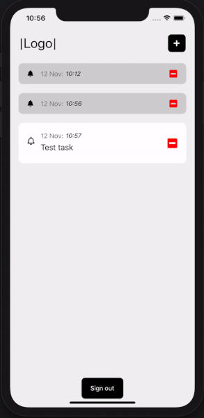

# remindy

### Reminder app for saving your tasks

React native app that allows user to add new tasks with time. After reaching this time it will show notification.
User can add, edit or remove tasks. App will automatically check if the task is older than 2 days and delete it.
It changes task to done after reaching it's time.
It is connected to firebase so there is also signup and signin screen.

### Demo

#### Tech stack

- expo
- expo push notifcations
- firebase as database
- redux for state management
- typescript
- react-navigation
- datetimepicker
- moment.js for formatting time

#### Running

Running is simple - yarn or npm install && expo start
